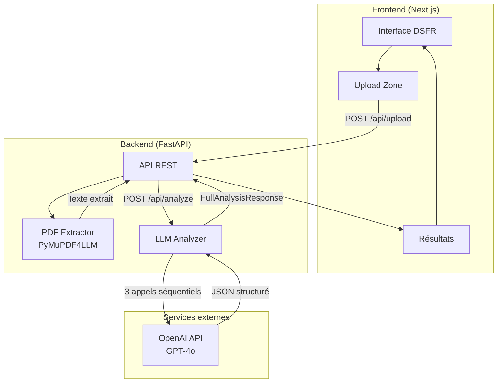
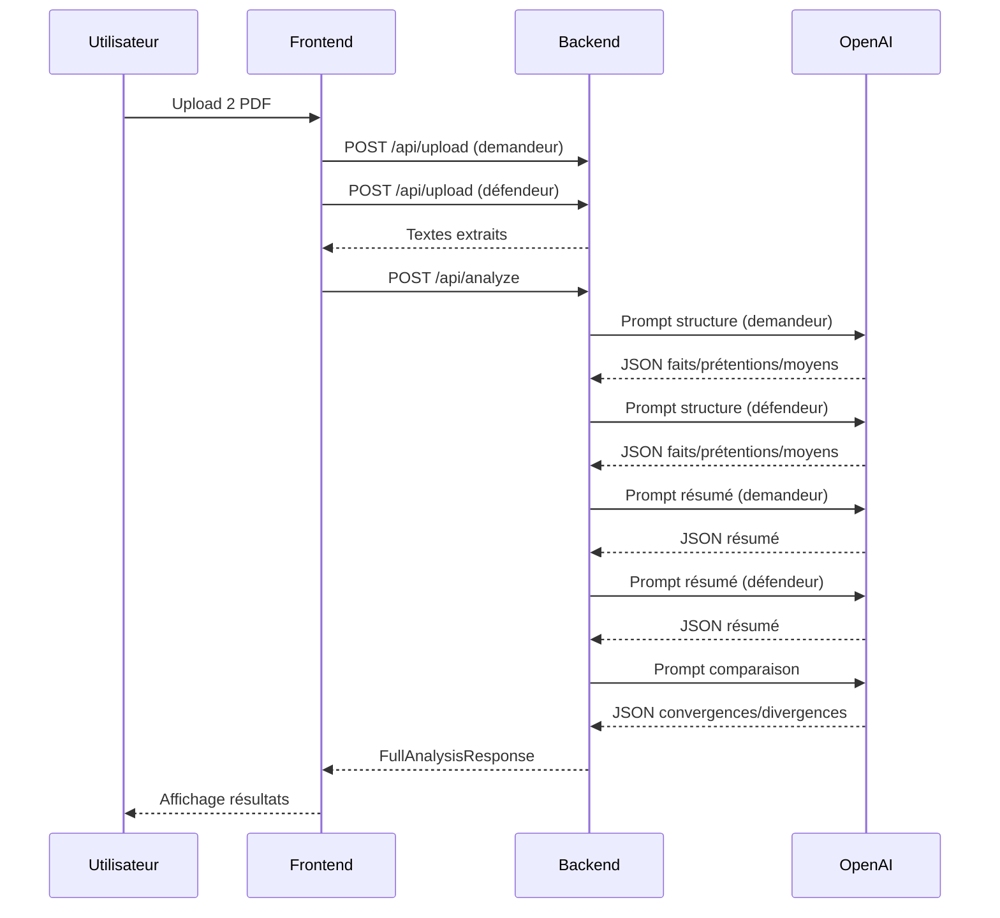

# Architecture POC — Mon Assistant Civil

## Vue d'ensemble



## Stack technique

| Composant | Technologie | Justification |
|-----------|-------------|---------------|
| Frontend | Next.js + react-dsfr | Framework React mature + Design System de l'État |
| Backend | FastAPI (Python 3.12) | Performance async, typage fort, documentation auto |
| Extraction PDF | PyMuPDF4LLM | Conversion PDF → Markdown optimisée pour LLM |
| LLM | OpenAI GPT-4o | Meilleur rapport qualité/prix pour l'analyse juridique |
| Déploiement | Docker Compose | Simplicité, reproductibilité |

## Pipeline d'analyse



## Endpoints API

| Méthode | Route | Description | Input | Output |
|---------|-------|-------------|-------|--------|
| GET | `/api/health` | Health check | - | `{"status": "ok"}` |
| POST | `/api/upload` | Upload PDF | `file` (PDF) + `party` | `ExtractionResult` |
| POST | `/api/analyze` | Analyse complète | `AnalyzeRequest` | `FullAnalysisResponse` |

## Modèle de données

```python
FullAnalysisResponse:
  demandeur: StructuredConclusions    # faits[], prétentions[], moyens[]
  defendeur: StructuredConclusions
  summary_demandeur: PartySummary     # party, summary
  summary_defendeur: PartySummary
  comparison: ComparisonReport        # convergences[], divergences[], key_issues[]
```

## Choix techniques et compromis

### Pourquoi PyMuPDF4LLM ?
- Conversion PDF → Markdown qui préserve la structure du document
- Plus fiable que l'OCR pour les PDF textuels (cas majoritaire pour les conclusions)
- Léger et rapide

### Pourquoi 3 appels LLM séquentiels ?
- Permet des prompts spécialisés et plus précis
- Chaque étape produit un JSON structuré validé par Pydantic
- Facilite le débugage et l'itération sur chaque prompt

### Pourquoi le CSS DSFR via CDN ?
- Compatibilité immédiate avec tous les bundlers
- Pas de problème de compilation SCSS en build time
- Acceptable pour un POC, à internaliser en production

## Limites du POC

1. **Pas de persistence** : aucune base de données, les analyses ne sont pas sauvegardées
2. **Pas d'authentification** : accès libre, pas de gestion des utilisateurs
3. **Dépendance OpenAI** : pas de fallback si l'API est indisponible
4. **PDF uniquement** : pas de support pour d'autres formats de documents
5. **Pas de RAG** : pas de contexte jurisprudentiel enrichi
6. **Pas de cache** : chaque analyse refait les appels LLM
7. **Prompts fixes** : pas de personnalisation par type d'affaire
