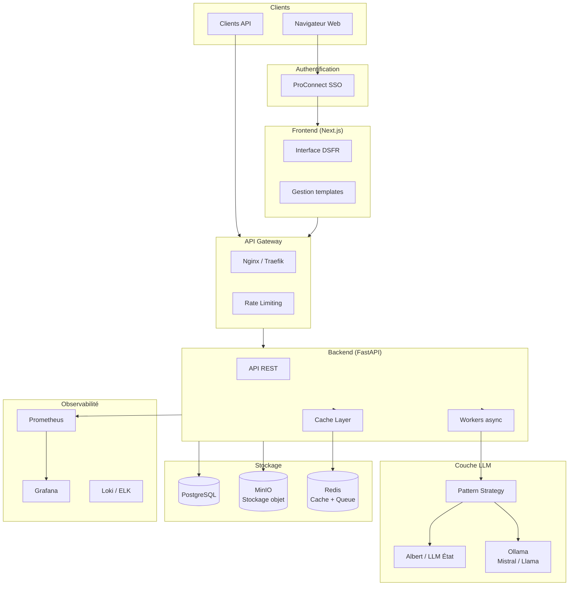
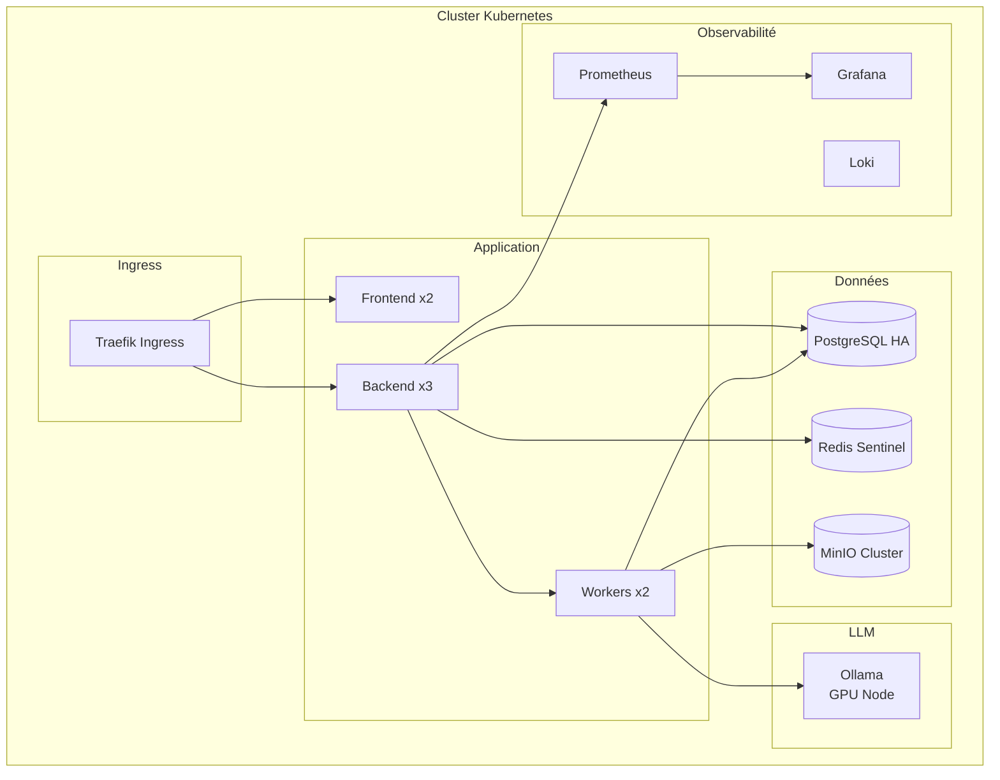

# Architecture Production — Mon Assistant Civil

## Vision

Transformer le POC en plateforme robuste, souveraine et scalable pour l'analyse de conclusions juridiques civiles au sein du système judiciaire français.

## Architecture cible



## Composants clés

### 1. LLM souverain — Pattern Strategy

```python
class LLMProvider(Protocol):
    async def complete(self, prompt: str) -> str: ...

class AlbertProvider(LLMProvider):
    """LLM de l'État français — prioritaire"""

class OllamaProvider(LLMProvider):
    """Ollama local (Mistral/Llama) — fallback souverain"""

class LLMService:
    def __init__(self, providers: list[LLMProvider]):
        self.providers = providers

    async def complete(self, prompt: str) -> str:
        for provider in self.providers:
            try:
                return await provider.complete(prompt)
            except Exception:
                continue
        raise LLMUnavailableError()
```

**Stratégie de migration** :
1. Phase 1 (POC) : OpenAI GPT-4o pour la démonstration de faisabilité
2. Phase 2 : Migration vers Ollama (Mistral/Llama) en local
3. Phase 3 : Migration vers Albert (LLM État) quand disponible en production

### 2. Authentification — ProConnect

- SSO de l'État français (successeur de FranceConnect Agent)
- Authentification des greffiers, magistrats, avocats
- Gestion des rôles et permissions par juridiction
- Conformité RGPD et référentiel RGS

### 3. Persistence et stockage

| Donnée | Stockage | Justification |
|--------|----------|---------------|
| Utilisateurs, sessions | PostgreSQL | Données relationnelles structurées |
| Analyses, historique | PostgreSQL | Traçabilité et audit |
| Documents PDF | MinIO | Stockage objet S3-compatible, souverain |
| Cache, sessions | Redis | Performance, TTL natif |
| Queue de tâches | Redis (ou RabbitMQ) | Traitement async des analyses longues |

### 4. Templates de prompts

```python
class PromptTemplate:
    id: UUID
    name: str
    jurisdiction_type: str  # TJ, CA, Cour de cassation
    case_type: str          # vices cachés, bail, divorce...
    structure_prompt: str
    summary_prompt: str
    comparison_prompt: str
    created_by: UUID
    version: int
```

- Templates personnalisables par juridiction et type d'affaire
- Versionnement des prompts avec historique
- Interface d'administration pour les référents
- A/B testing possible entre versions de prompts

### 5. Infrastructure



**Options d'hébergement souverain** :
- OVHcloud (SecNumCloud)
- Outscale (SecNumCloud)
- Cloud interne du Ministère de la Justice

**Scaling** :
- Frontend : réplicas stateless, CDN pour assets
- Backend : scaling horizontal, workers async pour les analyses LLM
- LLM : GPU dédié(s) pour Ollama, scaling vertical
- PostgreSQL : réplication streaming, pgBouncer pour le pooling
